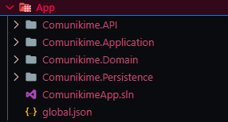
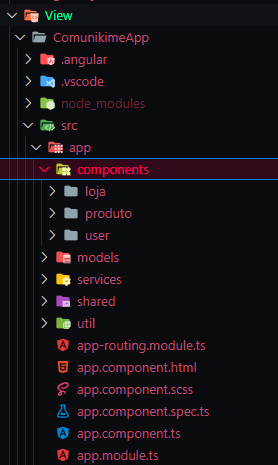
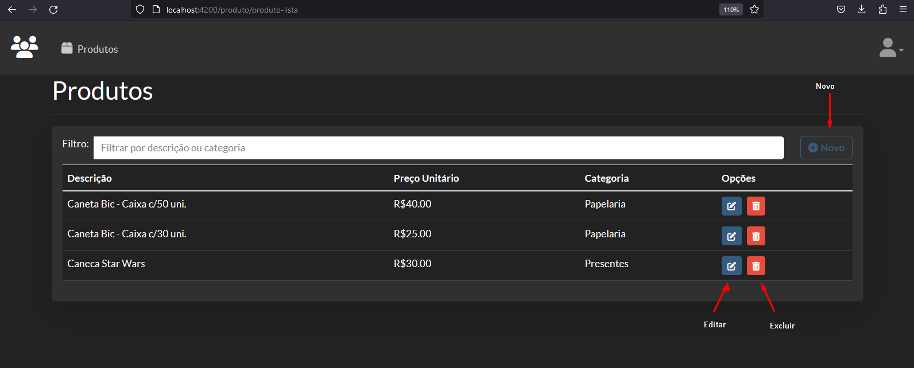
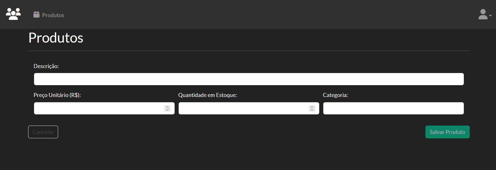

# Comunikime

O projeto a seguir se trata de um pequeno sistema que faz controle de estoque de produtos diversos e realiza as vendas destes produtos.

Desenvolvido em camadas contando com:
    
* API em .Net 5.0
  * Entity Framework 
* Front-end em Angular 16
  * Font-Awesome
  * Bootstrap 4.6
  * ngx-bootstrap 4

## Estrutura

### API

A solution envolvida na API é estruturada em 4 projetos divididos por funcionalidade.

### Front-End

Por se tratar de um framework focado em SPA(Single Page Application), a solução de páginas é feita por componentes.

## Como funciona?

### Instalação Local

Serão necessárias algumas instalações para executar o projeto local, sendo elas:

*   Versão SDK 5.0.408
* Após a instalação do SDK, serão necessários os comandos:
  * Para a instalação do EntityFramework:

    `dotnet tool install --global dotnet-ef --version 5.0.17`

  * Para criação da base de dados dentro da pasta **App\\**:
 
    `dotnet-ef database update -s .\Comunikime.API\`
---
 Versão 18.17.1

* Após a instalação, executar os comandos na pasta **View\ComunikimeApp**:
  * Para instalação do angular:
  
    `npm install -g @angular/cli@16.1.0`

  * O angular precisa de permissão para executar scripts powershell, caso não esteja habilitado em sua máquina, execute este comando para prosseguir com a instalação:
  
    `powershell -command "Set-ExecutionPolicy -Scope CurrentUser -ExecutionPolicy RemoteSigned"`

  * Para instalar as dependências do angular que não são enviadas para o Git, recupere as dependências com o comando:
  
    `npm install`
### Execução do projeto

Para execução do projeto são necessários 2 terminais:

* Para executar a API.
  * Na pasta do projeto **App\Comunikime.API**, execute o comando:

    `dotnet watch run`

* Para executar o Angular.
  * Na pasta do projeto **View\ComunikimeApp**, execute o comando:

    `ng serve -o`

### Funcionalidade

  * ### Cadastro de produtos

    A tela é capaz de realizar cadastrar novos, alterar e excluir produtos.

    

    Todos os campos são necessários para realizar o cadastro.

    

### Funções à implementar

* ***Melhoria dos dados de Produto***
* ***Controle de usuários***
* ***Venda de produtos***